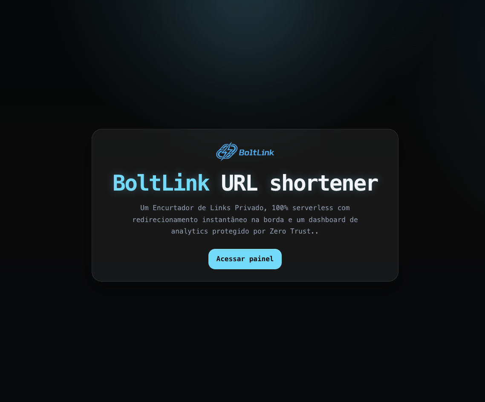
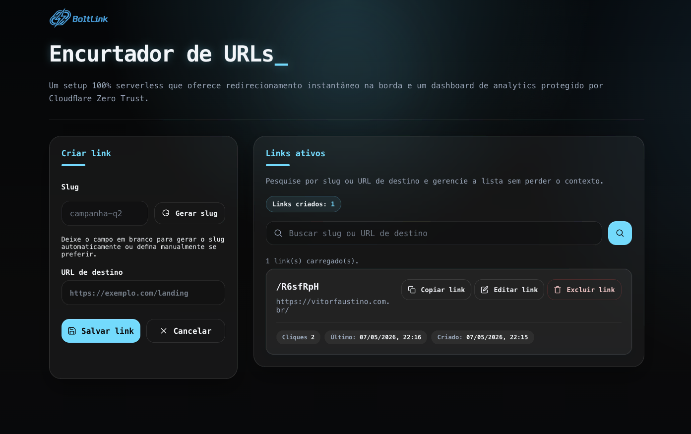
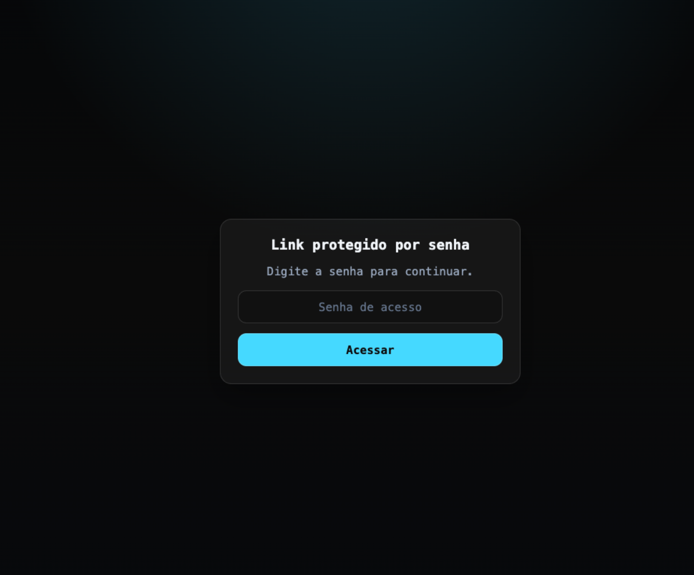

# BoltLink

BoltLink é um gestor de links com encurtamento de URLs que construí com **Cloudflare Workers**, **Hono**, **Cloudflare D1** e um painel administrativo estático servido pelo próprio Worker.

Sim, ele também é um encurtador de URL. É assim que a maioria das pessoas conhece esse tipo de sistema. Mas, na prática, o problema real é mais amplo: gestão de links. Redirecionar, medir cliques, preservar campanhas antigas e manter URLs que talvez estejam espalhadas em bio, vídeo, newsletter, QR Code, post patrocinado e documentação.

Na prática, ele serve para coisas bem concretas: link da bio, QR Code impresso, URL estável de campanha, link curto para vídeo, redirecionamento de documentação e gestão de links que você não quer terceirizar.

**Versão 1.1.0 — AGPL-3.0**

O projeto foi organizado para evoluir para um repositório público: com documentação orientada a operação, segurança, contribuição e automação com IA.

## Deploy na Cloudflare

[](https://deploy.workers.cloudflare.com/?url=https://github.com/vitorgfaustino/boltlink)

O botão acima publica o projeto diretamente na Cloudflare usando o `wrangler.jsonc` público do repositório.

Esse fluxo não substitui nem bloqueia o setup manual ou guiado por IA local. O projeto continua suportando `wrangler.local.jsonc` como configuração privada para operação local, troubleshooting e deploys explícitos por CLI.

No fluxo atual do botão:

- o Worker sobe em `workers.dev` por padrão
- o D1 pode ser provisionado automaticamente pela Cloudflare durante o deploy
- o schema base é inicializado automaticamente na primeira operação que usa o banco
- os assets estáticos em `public/` são enviados junto com o Worker

As variáveis configuradas manualmente no painel, como `TEAM_DOMAIN` e `POLICY_AUD`, são preservadas nos deploys automáticos para evitar reconfiguração repetida depois de cada atualização.

Se você publicou pelo botão da Cloudflare ou conectou o repositório Git ao Worker, o fluxo normal de atualização é pelo Git. Nesse caso, `npm run deploy` local não é obrigatório para atualizar o código.

Depois do deploy, ainda existem etapas manuais importantes:

1. Validar a URL pública em `workers.dev`.
2. Configurar o Cloudflare Zero Trust Access para `/admin`, `/admin.html`, `/api` e `/api/*`.
3. Configurar `TEAM_DOMAIN` e `POLICY_AUD` no ambiente implantado.
4. Opcionalmente configurar o secret `API_KEY` para automações em `/api` e `/api/*`.
5. Opcionalmente configurar o secret `IP_HASH_SECRET` para analytics com hash HMAC de IP.
6. Opcionalmente trocar `workers.dev` por domínio próprio.

Se o painel da Cloudflare mostrar `TEAM_DOMAIN` ou `POLICY_AUD` como "Este valor é um segredo criptografado" e o campo não permitir edição direta, trate isso como um valor criado no tipo errado. Nesse caso, recrie a variável como `Texto` no painel do Worker, preencha o valor real e publique novamente. No fluxo one-click, esses campos devem ficar como variáveis de texto do Worker, não como secrets.

Nos Workers Builds, o comando `npm run deploy` usa automaticamente o `wrangler.jsonc` público quando `WORKERS_CI=1` e `wrangler.local.jsonc` não existe no ambiente de build.

## Telas

<p align="center">
	
</p>

<p align="center">
	
</p>

<p align="center">
	
</p>
	
## O que este projeto faz

- Cria links curtos com slug customizado ou gerado automaticamente.
- Mantém o slug estável após a criação.
- Permite atualizar apenas a URL de destino no painel administrativo.
- Exibe uma landing page pública em `/` com identidade visual da marca.
- Expõe `GET /health` para checagem técnica do serviço.
- Registra cliques de forma assíncrona para não atrasar o redirect.
- Mantém analytics básicos no D1 com HMAC-SHA-256 de IP quando `IP_HASH_SECRET` está configurado, sem persistir IP puro, `Referer` ou `User-Agent` brutos.
- Protege `/admin`, `/admin.html`, `/api` e `/api/*` com Cloudflare Access, com `API_KEY` opcional apenas para automações de API.

## Arquitetura em alto nível

- Runtime: Cloudflare Workers
- Framework HTTP: Hono
- Banco: Cloudflare D1
- Frontend administrativo: HTML único em `public/admin.html`
- Assets estáticos: binding `ASSETS` em `wrangler.jsonc`
- Autenticação administrativa: Cloudflare Zero Trust Access com validação de JWT no próprio Worker

## Fluxo de funcionamento

1. Uma requisição para `/:slug` consulta a tabela `links`.
2. Se o slug existir e estiver ativo, o Worker responde com redirect `302`.
3. Depois da resposta, o Worker grava analytics usando `ctx.waitUntil()`.
4. O painel `/admin` consome os endpoints `/api/links` para criar, listar, editar, pesquisar e excluir links.
5. O acesso administrativo passa pelo middleware `requireAdmin`, que valida sessão do Cloudflare Access ou `Authorization: Bearer <API_KEY>`.

## Estrutura do repositório

- `src/index.ts`: Worker principal, rotas HTTP, validação de autenticação e gravação de analytics.
- `public/admin.html`: painel administrativo servido como asset estático.
- `schema.sql`: schema base do banco D1.
- `migrations/`: migrations versionadas do banco.
- `wrangler.jsonc`: configuração principal de deploy, bindings e assets.
- `test/index.spec.ts`: testes de comportamento do Worker.
- `docs/`: documentação operacional e de segurança.
- `AGENTS.md`: instruções para agentes de IA que trabalharem neste repositório.

## Requisitos

- Node.js 20 ou superior
- Conta Cloudflare ativa
- Domínio configurado na Cloudflare apenas se você quiser sair de `workers.dev` e usar custom domain
- Wrangler autenticado via `npx wrangler login`

## Começar só com IA

Se você é leigo ou não quer lidar com instalação manual, este é o caminho recomendado.

1. Abra o arquivo `AI-START.md`.
2. Entregue esse arquivo à IA e peça para ela começar lendo o conteúdo dele.
3. Use um pedido aceito simples, como `Iniciar o Projeto` ou `Atualizar o Projeto`.
4. Responda apenas à próxima pergunta que a IA fizer, sem adiantar outros dados.
5. Quando a IA pedir uma ação manual no painel da Cloudflare, faça só esse checkpoint e volte para o chat.

Se você não quiser clonar o repositório manualmente, basta fornecer apenas o arquivo `AI-START.md` à IA. Ela deve usar a URL do repositório contida no arquivo para obter o conteúdo do projeto na raiz correta e continuar o fluxo sem criar clone aninhado. Se o objetivo for publicar rápido com o botão do GitHub, o fluxo também deve considerar o `wrangler.jsonc` público como fonte de verdade desse deploy.

Se a sua IA tiver acesso a terminal e arquivos, `AI-START.md` é a instrução principal. Se ela não tiver, use o mesmo arquivo como guia para as instruções que a IA te der.


### Prefere fazer manualmente? Use o guia detalhado

Use este bloco apenas quando você estiver começando em uma pasta de destino vazia ou quando a IA for materializar o conteúdo do template na raiz final do projeto. Se a pasta atual já for um projeto seu com `.git`, o fluxo seguro é reaproveitar essa raiz e trazer apenas o conteúdo necessário, sem criar uma subpasta `boltlink` dentro dela.

1. Instale as dependências:

```bash
npm install
```

2. Prepare a configuração local e regenere os tipos públicos:

```bash
npm run setup
```

Esse comando sincroniza `wrangler.local.jsonc` com o template público mais recente sem apagar seus valores locais já definidos e mantém o redirecionamento local do Wrangler apontando para a configuração privada.

3. Se você preferir fazer isso passo a passo, também pode criar a configuração local segura manualmente:

```bash
npm run wrangler:init
```

Isso cria `wrangler.local.jsonc` e mantém `wrangler.jsonc` como template público. O arquivo local fica fora do Git e é onde você deve colocar os valores reais.

4. Revise `wrangler.jsonc`. O arquivo já foi sanitizado para publicação pública:

- o deploy padrão usa `workers.dev`
- o bloco de custom domain está comentado
- o D1 público fica sem `database_id` fixo para permitir provisionamento automático no fluxo one-click

5. Se você quiser manter o fluxo manual explícito, crie o seu banco D1 usando o config local e deixe o comando preencher o arquivo privado:

```bash
npm run wrangler -- d1 create <nome-do-banco> --binding db_boltlink --update-config
```

Se você pular esse passo, o primeiro `deploy` também pode provisionar o D1 automaticamente, mas o fluxo explícito acima continua sendo o caminho mais previsível para operação local.

6. Preencha `wrangler.local.jsonc` com os valores reais de `database_id` quando ele existir, além de `TEAM_DOMAIN` e `POLICY_AUD` se você já tiver configurado o Access.

7. Gere os tipos do Worker:

```bash
npm run cf-typegen
```

8. Se você quiser inicializar o banco localmente antes do primeiro uso real, aplique as migrations localmente:

```bash
npm run wrangler -- d1 migrations apply <nome-do-banco> --local
```

No deploy one-click e em bancos novos, o schema base também é criado automaticamente na primeira operação que usa o D1.

Se o projeto já tiver um binding ou `database_name` próprio, use sempre esse valor real nas migrations e, para a remota, prefira `-c wrangler.local.jsonc`. Se o arquivo privado ainda não existir, rode `npm run wrangler:init` ou retome o setup até ele ser criado.

9. Rode o projeto localmente:

```bash
npm run dev
```

10. Execute os testes:

```bash
npm test
```

Se você quiser forçar um deploy local usando o template público por troubleshooting, use um `--config` explícito:

```bash
npm run wrangler -- deploy --config wrangler.jsonc
```

Sem esse `--config`, o deploy local continua exigindo `wrangler.local.jsonc` para evitar publicar acidentalmente com o template sanitizado.

## Configuração segura

- `wrangler.jsonc` é o template público e auditável.
- `wrangler.local.jsonc` é a configuração operacional privada e está ignorada no Git.
- `npm run wrangler:init` cria ou sincroniza o arquivo local com o template público sem apagar seus overrides privados.
- `npm run setup` combina a sincronização do config local com a regeneração de tipos públicos.
- `npm run deploy`, `npm run dev` e `npm run wrangler -- ...` usam a configuração local quando ela existe.
- `npm run cf-typegen` continua lendo o template público para não expor valores reais no tipo gerado.
- `API_KEY` deve ser armazenada como secret e usada apenas em `/api` e `/api/*`, nunca como `vars` públicas.
- `IP_HASH_SECRET` deve ser armazenado como secret se você quiser gravar hashes de IP nos analytics; sem ele, `ip_hash` fica `NULL`.
- Se você separar `staging` e `production`, use `API_KEY` e `IP_HASH_SECRET` diferentes em cada ambiente e arquivos locais como `.dev.vars.staging` ou `.dev.vars.production` para testes locais.
- O template público permite deploy rápido sem `database_id` fixo; o arquivo local continua podendo armazenar um `database_id` real quando você escolher o fluxo manual explícito.

## Atualizar o projeto

O repositório já está preparado para upgrades sem sobrescrever a configuração local, porque `wrangler.local.jsonc` fica fora do Git.

### Primeiro download

Se você já tem Git instalado, pode clonar o repositório com:

```bash
git clone https://github.com/vitorgfaustino/boltlink.git
cd boltlink
```

Depois siga o fluxo de instalação ou o fluxo guiado por IA.

### Atualizar uma instalação já em uso

Antes de atualizar, decida como você publica o projeto. Isso afeta onde as variáveis do Worker devem ficar:

| Método de publicação | Onde fica TEAM_DOMAIN e POLICY_AUD | keep_vars | vars no wrangler.local.jsonc |
|---|---|---|---|
| **GitHub auto-deploy** (Worker conectado ao repo) | Apenas no painel do Worker na Cloudflare | `true` no template público | **Remover** do local config |
| **Deploy local** (`npm run deploy`) | No painel OU no local config | `true` no local | Somente com valores reais |

**Regra importante**: se você usa GitHub auto-deploy, NUNCA deixe `vars` com `TEAM_DOMAIN` ou `POLICY_AUD` vazios no `wrangler.local.jsonc`. Strings vazias sobrescrevem os valores do painel durante o deploy. O mesmo vale para `keep_vars: false` — isso apaga variáveis do painel.

Se o seu Worker está ligado ao GitHub na Cloudflare, o código publicado passa a vir do Git. Nesse cenário, `TEAM_DOMAIN` e `POLICY_AUD` continuam sendo configurados no painel do Worker, e os deploys automáticos preservam esses valores.

Use `npm run deploy` apenas quando você opera o projeto localmente com `wrangler.local.jsonc` e quer publicar manualmente pela sua máquina.

Se esse repositório já foi adaptado para um Worker real, preserve também os valores individualizados do seu `wrangler.jsonc`, principalmente `name`, `routes`, `workers_dev`, `preview_urls`, `d1_databases` e bindings já ligados ao projeto em produção. Atualização de template não deve trocar a identidade do seu Worker por `boltlink`, refazer rotas, mexer no preview ou renomear o banco do projeto.

Se você já tem uma cópia do projeto em execução, faça assim:

```bash
git pull --ff-only
npm install
npm run wrangler:init
npm run cf-typegen
```

Depois valide o que mudou com o checklist pós-atualização:

- confira se `wrangler.local.jsonc` continua preservado como configuração local privada e se `wrangler.jsonc` manteve os valores individualizados do projeto
- confirme que `src/index.ts` continua com as regras de auth, rotas e segurança do projeto em uso
- confirme que `public/admin.html`, `public/logo.png` e `public/favicon.ico` não foram sobrescritos sem confirmação explícita
- **verifique se `wrangler.local.jsonc` não tem `vars` vazios** (especialmente `TEAM_DOMAIN` e `POLICY_AUD`)
- **verifique se `keep_vars` está `true`** no config que você usa para deploy
- rode `npm run cf-typegen` se houver mudança de binding
- rode `npm test` para validar a atualização
- confirme que a árvore do projeto não ganhou clone aninhado nem `.git` herdado
- se houver migrations novas, aplique-as com `npm run wrangler -- d1 migrations apply <nome-do-banco> --local` e, em produção, também com `--remote`
- se a atualização trouxer novas bindings, rode `npm run cf-typegen` novamente após ajustar o arquivo local
- se o projeto já estiver rodando, reinicie `npm run dev`

Se houver troca de versão, mantenha `RELEASE_NOTES.md` apenas com os ajustes da versão atual e deixe o histórico consolidado em `CHANGELOG.md`.

Se a pessoa estiver usando o fluxo guiado por IA, o prompt de entrada continua sendo `Iniciar o Projeto` para uma primeira instalação e `Continuar configuração do projeto` para uma cópia já existente.

## Guias detalhados

### Operação com IA

- `AI-START.md`: entrada única para qualquer IA iniciar o fluxo operacional do projeto.
- `docs/ai-guided-operations.md`: runbook canônico para qualquer IA guiar a operação do projeto.
- `docs/ai-accepted-requests.md`: catálogo exclusivo de pedidos aceitos, exemplos e perguntas obrigatórias.

### Setup e referência

- `docs/cloudflare-setup.md`: passo a passo de configuração e deploy na Cloudflare.
- `docs/admin-auth.md`: autenticação do painel administrativo com Cloudflare Access.
- `docs/architecture.md`: visão de arquitetura, fluxo de dados e decisões do projeto.

### Governança e colaboração

- `AGENTS.md`: instruções e guardrails para agentes de IA que trabalhem neste repositório.
- `CHANGELOG.md`: principais ajustes, correções e endurecimentos da versão atual.
- `RELEASE_NOTES.md`: texto formatado para a release 1.0.0 no GitHub.
- `CONTRIBUTING.md`: convenções para contribuições futuras.
- `SECURITY.md`: políticas mínimas de segurança e tratamento de segredos.
- `docs/github-release-checklist.md`: checklist final para publicar o repositório e a release 1.0.0 no GitHub.

## Operação guiada por IA

Se você quiser colocar o projeto em operação com ajuda de chat, comece por `AI-START.md`. Esse arquivo já aponta para o fluxo correto e para os documentos canônicos.
Os pedidos aceitos, o fluxo guiado e o que ainda depende de ação manual estão documentados em [AI-START.md](AI-START.md), [docs/ai-guided-operations.md](docs/ai-guided-operations.md) e [docs/ai-accepted-requests.md](docs/ai-accepted-requests.md). Quando a IA já estiver dentro da raiz do projeto do usuário, ela deve obter apenas o conteúdo do template na pasta correta, sem herdar `.git` do repositório oficial nem criar um clone aninhado. Quando o usuário optar pelo botão do GitHub, a IA deve tratar o `wrangler.jsonc` público como a configuração de deploy e deixar o Access como handoff manual de pós-deploy.

Exemplos úteis para o chat:

- `Iniciar o Projeto`
- `Atualizar o Projeto`
- `Publicar com o botão da Cloudflare`
- `Mudar domínio para links.example.com`
- `Auditar estado operacional`
- `Preparar Access`

## Contribuições e Suporte

Este repositório está público para estudo, uso como referência e adaptação conforme a licença do projeto, mas não aceita Pull Requests externos neste momento.

Essa decisão existe para preservar a visão autoral, manter consistência técnica e concentrar a manutenção em um fluxo único.

Se você encontrar um bug, tiver uma dúvida ou quiser sugerir uma melhoria, abra uma Issue. Issues são o canal oficial e bem-vindo para feedback, suporte e relato de problemas.

Pull Requests abertos por terceiros podem ser fechados automaticamente com uma mensagem explicativa.

## Convenções importantes

- `wrangler.jsonc` é o template público da configuração do Worker.
- `wrangler.local.jsonc` é a configuração privada do ambiente local e não deve ser versionada.
- Alterações no schema devem atualizar `schema.sql` e a migration correspondente.
- Alterações em bindings exigem regenerar `worker-configuration.d.ts` com `npm run cf-typegen`.
- A landing page pública fica em `/`; o redirect de conteúdo continua em `/:slug` e a checagem técnica em `/health`.
- O slug é imutável após a criação.
- O redirect não deve esperar a gravação de analytics.
- IPs não devem ser persistidos em texto puro.
- Exemplos públicos e documentação devem usar domínios genéricos como `links.example.com`.

## Marca e ativos visuais

- `public/logo.png` e `public/favicon.ico` fazem parte da identidade pública original do projeto BoltLink.
- Esses ativos devem preservar a atribuição ao projeto original criado por Vitor Faustino quando forem redistribuídos junto com este repositório.
- O código e a licença deste projeto mantêm essa referência de autoria de forma explícita.

## Recomendações para evolução open source

- Adicionar ambientes nomeados em `wrangler.jsonc` para separar `staging` e `production`.
- Publicar um fluxo de release versionado antes do primeiro release público.
- Ampliar a suíte de testes para incluir cenários de autenticação do admin e stats.
- Expandir o CI para cobrir documentação e validação de migrations além dos testes atuais.

## Licença

Este projeto é disponibilizado sob a **GNU Affero General Public License v3.0 (AGPL-3.0)**. 
O uso comercial é permitido, mas qualquer modificação e/ou uso do sistema em rede (incluindo Software as a Service - SaaS) obriga o compartilhamento do código-fonte completo de qualquer trabalho derivado com os usuários sob a mesma licença. Consulte o arquivo `LICENSE` para os termos completos.

**Isenção de Responsabilidade (Disclaimer):**
Este software é fornecido "como está", sem garantias de qualquer tipo. O autor (Vitor Faustino - vitorfaustino.com.br) está 100% isento de responsabilidades por danos, perdas ou resultados imprecisos decorrentes do uso do software ou de sua IA subjacente.

---

Versão 1.0.0
Criado por Vitor Faustino - vitorfaustino.com.br
