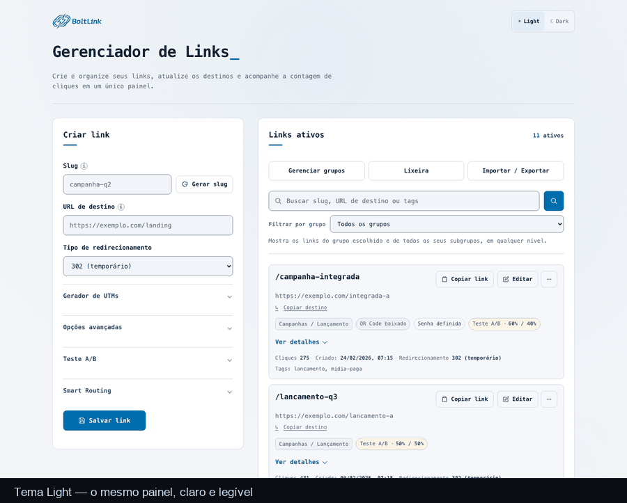
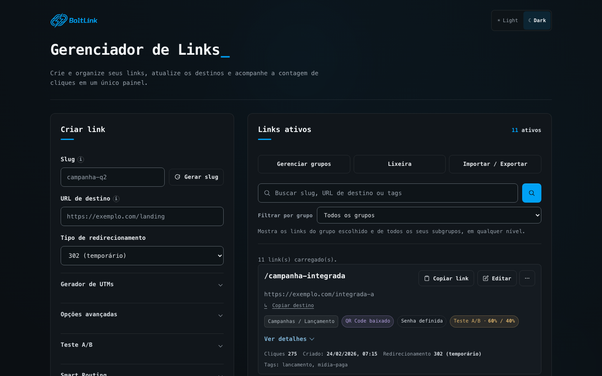
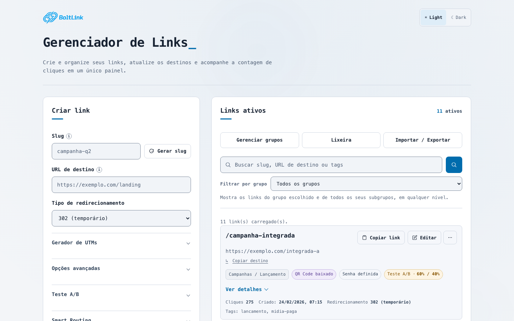
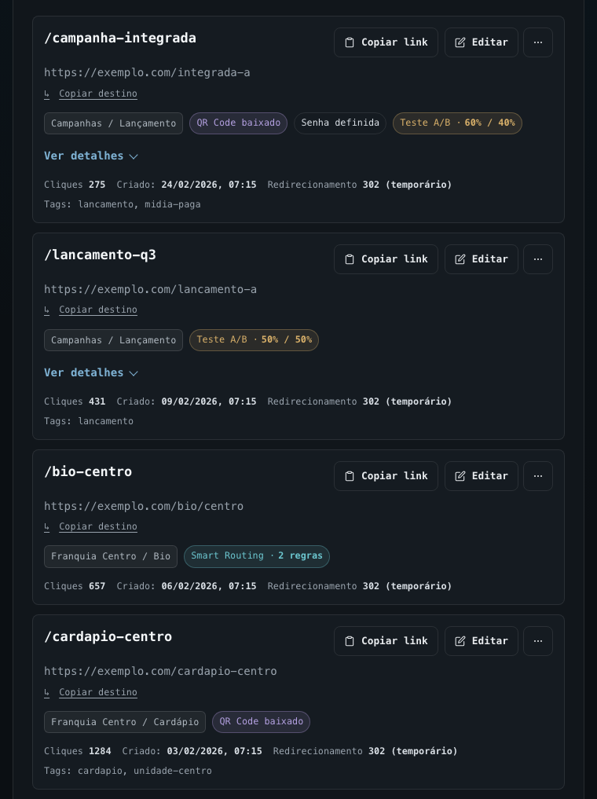
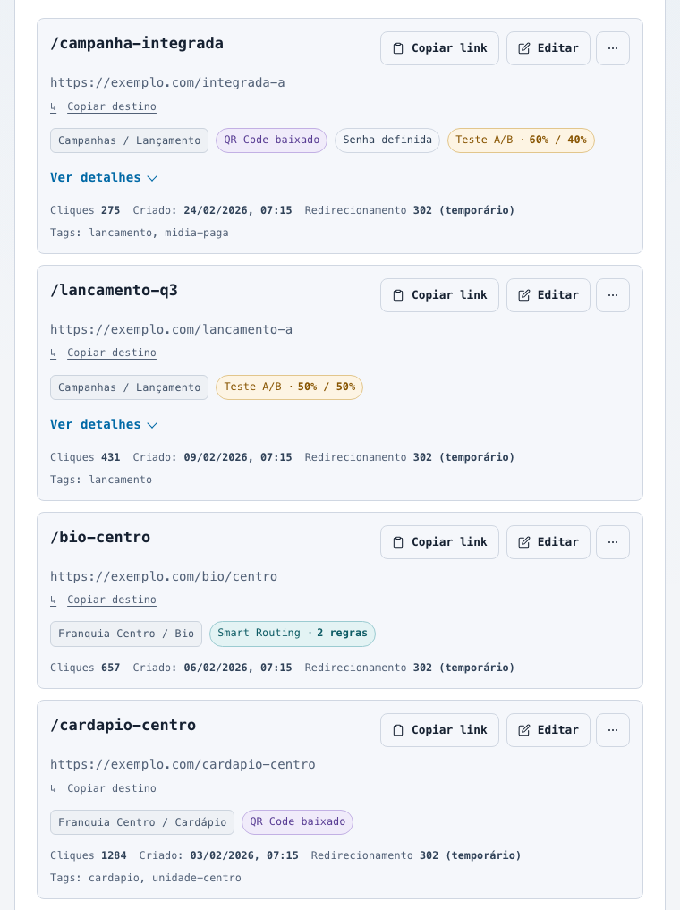
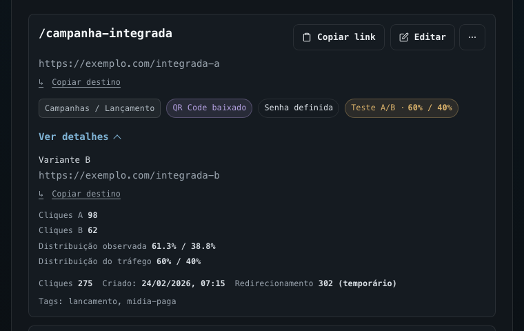
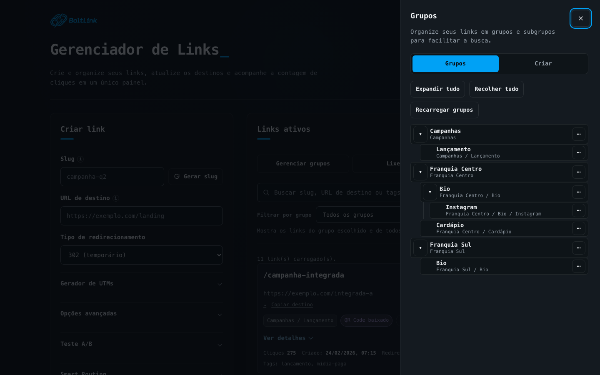
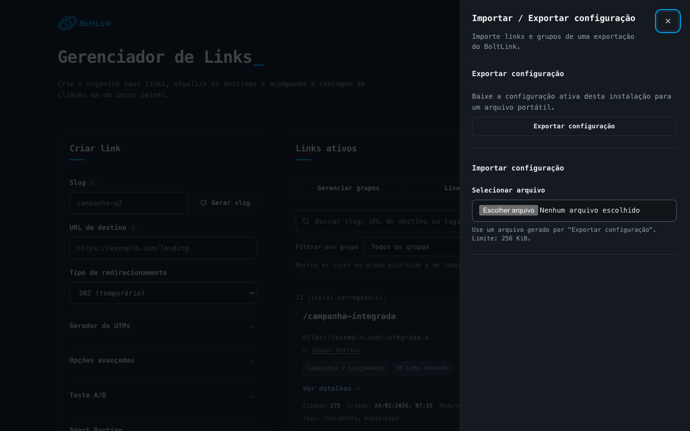
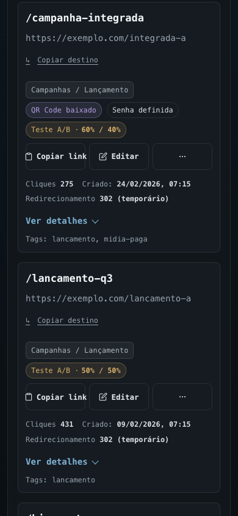
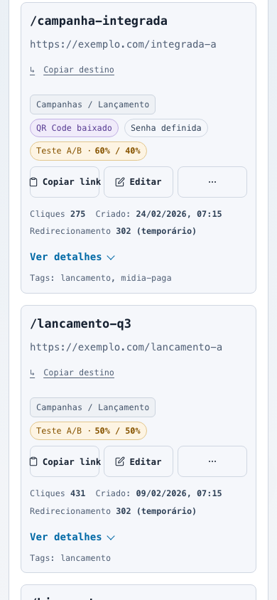

# BoltLink

**Encurtador de links self-hosted para campanhas, QR Codes e materiais impressos — com controle do destino, privacidade por padrão e um painel agradável de usar.**

BoltLink roda na sua própria conta Cloudflare. Crie um link curto, organize em grupos e mude o destino quando precisar: o endereço divulgado continua o mesmo, então o QR Code impresso, o link da bio e o material de campanha podem continuar em uso. O painel reúne criação, edição, contagem agregada de cliques e as ferramentas de operação em um só lugar — em tema claro ou escuro.

- **Privacy-first e self-hosted:** controle da instalação e contagens agregadas.
- **Recursos de campanha:** QR Code, Smart Routing, Teste A/B, agendamento e expiração.
- **Operação diária:** grupos, Lixeira e recuperação, Import/Export e temas Light/Dark.

Sem perfil de visitante, sem cookie de rastreamento e sem serviços externos de analytics: o Worker responde o redirect antes de contar o clique, e o banco guarda apenas contagens agregadas. O QR Code sai em PNG e SVG, os grupos têm hierarquia com caminho completo, e a configuração viaja entre instalações em um documento portátil.

Demonstração com nomes, URLs e contagens fictícios. As [capturas estáticas](#screenshots) permitem explorar cada tela sem depender da animação.

## Por que usar o BoltLink

- **Seus materiais continuam válidos.** Troque o destino de um link sem substituir o QR Code impresso, a bio ou a URL já divulgada.
- **A operação fica organizada.** Separe clientes, unidades e campanhas em grupos e subgrupos, veja o caminho completo e filtre um grupo trazendo todos os descendentes.
- **A instalação é sua.** Worker, banco e configuração ficam na sua conta Cloudflare, e o painel é protegido com Cloudflare Access.
- **Você mede sem rastrear pessoas.** Contagens agregadas de cliques e distribuição A/B, sem persistir IP, país, dispositivo ou histórico individual de visitas.
- **Recursos de campanha no mesmo lugar.** Teste A/B, destinos por país ou dispositivo, proteção por senha, agendamento, expiração e destino após expirar.

## Screenshots

As capturas e o GIF mostram a interface real da versão 3.2.0 com dados fictícios. Nomes, URLs e contagens ilustram os recursos; não representam clientes ou tráfego real.

### Visão geral — tema Dark

O mesmo painel, em tema escuro sóbrio: criação e edição à esquerda, links ativos à direita, com busca, filtro por grupo e ferramentas de administração.

### Light e Dark

Tema Light · Tema Dark. Abra uma captura para ver em tamanho original.

  
  

Os dois temas compartilham a mesma estrutura, hierarquia e contraste. A troca é feita no cabeçalho e a preferência fica salva no navegador.

### Cards com recursos do sistema

Tema Dark · Tema Light. Abra uma captura para ver em tamanho original.

  
  

Cada recurso tem uma cor fixa — Teste A/B em âmbar, Smart Routing em ciano, QR Code em violeta — enquanto grupo e tags, que são dados da sua operação, permanecem neutros. Assim dá para responder "que recurso este link usa?" sem confundir com "em que grupo ele está?".

### Detalhes do Teste A/B

O card mostra o resumo do experimento; variante B, contadores e distribuição aparecem sob demanda em um expansor acessível, sem ocupar a lista.

### Grupos e portabilidade

Grupos hierárquicos · Importar / Exportar. Abra uma captura para ver em tamanho original.

  
  

Grupos aceitam até 16 níveis, contando a raiz, e o filtro inclui todos os descendentes. A exportação gera um documento portátil com a configuração lógica, para levar de uma instalação a outra.

### Mobile

Dark · Light. Abra uma captura para ver em tamanho original.

  
  

No celular as ações viram uma grade de três colunas com alvos de 44px, as badges quebram linha sem cortar nenhum recurso e a metadata se reorganiza em duas linhas — sem rolagem horizontal.

## Principais recursos

| Recurso | O que você pode fazer |
| --- | --- |
| Gerenciamento de links | Criar, editar destinos, duplicar e organizar com tags |
| QR Codes | Visualizar e baixar PNG ou SVG do link curto |
| Grupos e hierarquia | Ver o caminho completo e filtrar um grupo com todos os subgrupos |
| UTMs | Montar parâmetros de campanha e editar os valores já presentes na URL |
| Split Test A/B | Distribuir cliques entre dois destinos, com contadores agregados |
| Smart Routing | Escolher destinos por país ou dispositivo, sem guardar esses dados |
| Proteção por senha | Restringir o acesso a links selecionados |
| Agendamento e expiração | Definir ativação, expiração e um destino após expirar |
| Lixeira | Restaurar links ou excluir definitivamente com confirmação |
| Import/Export | Transferir a configuração lógica entre instalações |
| Estatísticas agregadas | Acompanhar cliques totais e distribuição A/B, sem analytics por visitante |
| Light/Dark theme | Escolher o tema do painel |
| Privacidade por padrão | Operar sem perfis de visitantes nem rastreamento individual |

Smart Routing e Split Test A/B são opções alternativas por link. A contagem A/B mede cliques, sem calcular conversões ou declarar um vencedor. A portabilidade de configuração não substitui backup do banco.

## Casos de uso

- **Links da bio e redes sociais.** Um endereço curto e estável por unidade, campanha ou perfil.
- **QR Codes em materiais impressos.** Cardápios, embalagens, vitrines e eventos: o destino pode mudar depois da impressão.
- **Campanhas com UTM.** Monte e ajuste os parâmetros direto no painel, sem editar a URL à mão.
- **Operação com várias unidades.** Grupos como `Franquia Centro / Bio / Instagram` deixam o contexto visível sem mudar os endereços públicos.
- **Testes e roteamento.** Compare dois destinos com o Teste A/B ou direcione por país e dispositivo com o Smart Routing.

## Como funciona

O BoltLink tem duas partes com responsabilidades separadas. O **redirect público** resolve o slug e responde antes de contar o clique, sem consultar grupos e sem guardar dados do visitante. O **painel administrativo** é um app estático protegido pelo Cloudflare Access que conversa com a API do Worker. O banco é um D1 na sua conta, e as métricas são apenas contagens agregadas.

## Deploy rápido

Você precisa de uma conta Cloudflare e uma conta GitHub. O botão copia o repositório para o seu GitHub, provisiona o D1 e prepara o Worker na sua conta Cloudflare. Configure o Cloudflare Access para proteger o painel e a API seguindo o [guia de instalação](docs/cloudflare-setup.md) e o [guia de autenticação](docs/admin-auth.md).

**O botão aponta para `main`, que distribui a release publicada 3.2.1.** `ROOT_REDIRECT_URL` aparece no setup como **Text opcional**: deixe vazio para manter a página inicial, ou informe a URL para a qual deseja redirecionar a raiz `/`.

## Instalação e configuração

- [Setup na Cloudflare](docs/cloudflare-setup.md): instalação pelo botão, Wrangler ou operação guiada por IA.
- [Cloudflare Access](docs/admin-auth.md): proteção administrativa e variáveis da instalação.
- [Referência técnica](docs/technical-reference.md): comandos, configurações, compatibilidade histórica e matriz de variáveis/secrets.

## Atualização

- [Atualização e migrations](docs/upgrading.md): upgrade de instalações existentes e backups.
- O deploy padrão aplica as migrations pendentes antes de publicar o Worker; uma falha impede o deploy.
- Publicar código não atualiza instalações self-hosted: cada instalação executa o próprio upgrade.

## Documentação complementar

- [Admin UX](docs/admin-ux.md): filtro hierárquico, badges com caminho completo e edição de UTMs.
- [Lixeira e recuperação](docs/trash-recovery.md).
- [Senhas em links](docs/password-links.md).
- [Privacidade](docs/privacy.md) e [política de cliques](docs/click-policy.md).
- [Capacidade e tráfego no plano gratuito](docs/free-plan-traffic.md).
- [Notas de versão](RELEASE_NOTES.md) e [Changelog](CHANGELOG.md).

## Arquitetura e desenvolvimento

BoltLink usa Cloudflare Workers, Hono, D1 e um painel estático. O redirect público e a configuração administrativa têm responsabilidades distintas; o projeto conserva apenas métricas agregadas.

Consulte a [arquitetura](docs/architecture.md), o [desenvolvimento local](docs/local-development.md) e o [ponto de entrada para IA](AI-START.md).

## Estado das versões

A **3.2.1 está publicada**, identificada pela tag **v3.2.1**. A release anterior **v3.2.0** permanece congelada. Publicar código não atualiza instalações self-hosted.

A manutenção 3.2.1 acrescenta preflight D1 e proteção das configurações durante upgrades, sem alteração funcional no Admin. Consulte o [upgrade seguro](docs/upgrading.md#upgrade-seguro--321).

## Licença

[AGPL-3.0](LICENSE). Criado por Vitor Faustino — [vitorfaustino.com.br](https://vitorfaustino.com.br).
