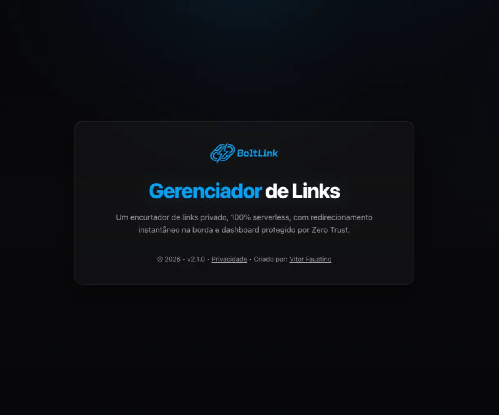
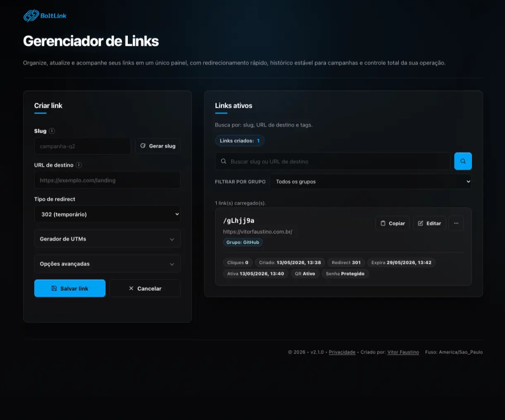

# BoltLink

BoltLink é um gerenciador de links com Cloudflare Workers, Hono, D1 e painel administrativo estático.

**Versão 2.2.1 - AGPL-3.0**

> Release publicada: **v2.2.1**. O Smart Routing (Fase 3, migration `0005_smart_routing.sql`) e o destino de expiração + `ROOT_REDIRECT_URL` (Fase 4, migration `0006_expired_redirect.sql`) descritos neste documento estão em **Unreleased** nesta branch de desenvolvimento e ainda não fazem parte da release/tag publicada. Um checkout da tag `v2.2.1` não contém nenhum desses recursos nem as migrations `0005`/`0006`.

Ele funciona como encurtador de URLs, mas o objetivo real do projeto é maior: manter links públicos estáveis, simples de operar e independentes de plataformas terceiras, com controle do redirect, proteção do painel e uma baseline de privacidade mais rígida do que a maioria das ferramentas desse tipo.

Esta versão muda o produto para uma baseline LGPD mais rígida:

- sem `stats`
- sem `IP_HASH_SECRET`
- sem `last_clicked_at`
- sem `notes`
- contagem apenas agregada em `clicks_total`
- `Referrer-Policy: strict-origin` nos redirects públicos
- `Referrer-Policy: no-referrer` no admin, API e demais respostas

## O que é o BoltLink

Na prática, o BoltLink existe para resolver cenários como:

- link da bio que precisa continuar estável
- QR Code impresso que não pode quebrar
- URL curta para campanhas, materiais, vídeos e documentos
- gestão própria de links sem depender de serviços externos para redirect e painel

O foco do sistema é manter o caminho crítico do redirect enxuto e previsível, enquanto o painel administrativo continua suficiente para operação real do dia a dia.

## O que diferencia este projeto

- **Controle do stack**: o redirect, o painel e o banco ficam no mesmo projeto, em Cloudflare Workers + D1.
- **Privacidade por padrão**: a linha `2.0.x` mantém analytics detalhado por evento fora do produto e conserva apenas contagem agregada.
- **Admin protegido**: o painel continua pensado para operar com Cloudflare Access.
- **Produto pequeno, mas operacional**: slug imutável, QR code, grupos, tags, expiração, ativação e links com senha já fazem parte do fluxo.
- **Distribuição aberta com AGPL**: quem adaptar e operar em rede precisa manter o código derivado sob a mesma licença.

## Telas

<p align="center">
  
</p>

<p align="center">
  
</p>

<p align="center">
  
</p>

## Deploy na Cloudflare

[](https://deploy.workers.cloudflare.com/?url=https://github.com/vitorgfaustino/boltlink)

O botão continua funcional com o `wrangler.jsonc` público.

## Três formas de usar

### 1. Wrangler local (release publicada v2.2.1)

Fluxo da tag `v2.2.1`, que termina na migration `0003_lgpd_minimization.sql`:

```bash
npm install
npm run setup
npm run wrangler -- d1 migrations apply <nome-do-banco-ou-binding-real> --local
npm run dev
npm test
```

Se quiser criar o D1 explicitamente:

```bash
npm run wrangler -- d1 create <nome-do-banco> --binding db_boltlink --update-config
```

Se quiser criar o D1 já com jurisdição:

```bash
npm run wrangler -- d1 create <nome-do-banco> --binding db_boltlink --update-config --jurisdiction=eu
```

O runtime não cria schema. Com o banco sem schema, a API e os redirects respondem `503 Database schema is not initialized`; aplique as migrations e o mesmo isolate volta a funcionar sem restart.

Para inspecionar dados manualmente com um SQLite auxiliar:

```bash
npm run dev-init
```

Esse comando cria `.dev-env/db.sqlite3` (migrations + seed) apenas para exploração local com `sqlite3`. Ele **não** é o D1 usado pelo Worker. O diretório `.dev-env/` é ignorado pelo Git e não vai para o GitHub.

#### Ambiente local de desenvolvimento (Phase 2 local)

No baseline local da Fase 2 (`23353a1`, não publicado) existe o script `npm run dev-prepare`, que lê o banco configurado em `wrangler.jsonc`/`wrangler.local.jsonc` e aplica a cadeia de migrations no D1 local usado pelo `wrangler dev` (`.wrangler/state/v3/d1`):

```bash
npm run dev-prepare
npm run dev
```

Nessa base, `dev-prepare` aplica `migrations/0000` a `0004` e habilita o Split Test A/B.

`npm run dev-prepare` **não existe** no checkout da tag `v2.2.1`. Lá, use `npm run wrangler -- d1 migrations apply ... --local`, como no fluxo publicado acima.

#### Ambiente local de desenvolvimento (Unreleased / Fase 3)

No HEAD congelado da Fase 3 (`548f179`), `npm run dev-prepare` aplica a cadeia até `migrations/0005`, fonte autoritativa de `links.smart_routing_rules`:

```bash
npm run dev-prepare
npm run dev
```

Sem a `0005` (por exemplo num checkout da tag), o produto funciona normalmente e apenas o recurso de roteamento fica indisponível.

#### Ambiente local de desenvolvimento (Unreleased / Fase 4)

Na working tree atual da Fase 4 (sobre `548f179`), `npm run dev-prepare` aplica a cadeia até `migrations/0006`, fonte autoritativa de `links.expired_redirect_url`:

```bash
npm run dev-prepare
npm run dev
```

Sem a `0006`, o produto funciona normalmente; apenas o destino de expiração fica indisponível (a API recusa o campo com `400` e o Admin oculta a seção).

### 2. Operação guiada por IA

Comece por `AI-START.md`.

Pedidos úteis:

- `Iniciar o Projeto`
- `Atualizar o Projeto`
- `Aplicar migrations`
- `Auditar estado operacional`

### 3. One-click / GitHub auto-deploy

Depois do deploy:

1. aplicar as migrations no D1 (`npm run wrangler -- d1 migrations apply <nome-do-banco-ou-binding-real> --remote -c wrangler.local.jsonc`); sem isso a API e os redirects respondem `503 Database schema is not initialized`
2. validar `workers.dev`
3. configurar Access para `/admin`, `/admin.html`, `/api` e `/api/*`
4. preencher `TEAM_DOMAIN` e `POLICY_AUD`
5. opcionalmente configurar `API_KEY`; configurar `PASSWORD_SESSION_SECRET` se a instância usar links protegidos por senha
6. opcionalmente trocar para domínio próprio

Se você utiliza o recurso de links protegidos por senha, **deve obrigatoriamente** configurar o `PASSWORD_SESSION_SECRET`. Se não for configurado, a criação e o acesso aos links com senha falharão.
Se você usa GitHub auto-deploy ou o botão de deploy da Cloudflare, configure `PASSWORD_SESSION_SECRET` no painel da Cloudflare como `Secret`.
Se você publica com Wrangler local, use `.dev.vars` para desenvolvimento e `wrangler secret put PASSWORD_SESSION_SECRET` para o Worker implantado.

Comandos simples para gerar secrets:

```bash
openssl rand -hex 32
openssl rand -base64 32
```

Sugestao pratica:

- use um dos comandos acima para gerar `PASSWORD_SESSION_SECRET`
- use outro valor aleatorio independente para `API_KEY`

## Página pública de privacidade

A instância publicada agora inclui uma página pública em `/privacidade`, servida a partir de `public/privacidade.html`.

Esse arquivo é um ponto de partida e deve ser adaptado pelo operador antes do uso público real.

## O que o projeto faz

- cria links curtos com slug customizado ou automático
- mantém slug imutável
- protege links opcionais com senha
- permite grupos, tags, QR code, ativação e expiração
- permite Split Test A/B com distribuição stateless e apenas contadores agregados (Phase 2 local, não publicado)
- permite Smart Routing por país e dispositivo, com a primeira regra compatível vencendo e fallback no destino principal (Unreleased / Fase 3)
- permite configurar um destino usado depois da expiração do link: com destino válido o link expirado responde `302`, sem destino responde `410`; requests expirados não contam clique (Unreleased / Fase 4)
- permite redirecionar a raiz (`GET /`) para uma URL operacional via `ROOT_REDIRECT_URL`, sem consultar D1 (Unreleased / Fase 4)
- organiza links em grupos hierárquicos, com prevenção de ciclos, limite de 16 níveis, movimentação com detecção de concorrência e exclusão só de grupo realmente vazio (Unreleased / Fase 5)
- exporta a configuração lógica da instância em um JSON portátil, com download pelo Admin e sem senhas, métricas ou IDs internos (Unreleased / Fase 5)
- conta cliques de forma agregada sem eventos detalhados
- permite zerar a estatística agregada de um link ativo
- inclui orientações para reduzir tráfego desnecessário no plano gratuito da Cloudflare

## Upgrade para v2.2.1

Procedimento da **release publicada (tag `v2.2.1`)**, que termina na migration `0003_lgpd_minimization.sql`:

```bash
git pull --ff-only
npm install
npm run wrangler:init
npm test
```

Se a instância ainda estiver em uma linha anterior à baseline LGPD da `2.0.0`, aplique também:

```bash
npm run wrangler -- d1 migrations apply <nome-do-banco-ou-binding-real> --local
npm run wrangler -- d1 migrations apply <nome-do-banco-ou-binding-real> --remote -c wrangler.local.jsonc
```

Para instalações já alinhadas com `2.0.0`, o upgrade base não exige migration nova nem bindings novos.

Procedimento recomendado:

1. backup conforme o procedimento da instância;
2. aplicar as migrations pendentes (`npm run wrangler -- d1 migrations apply ...`);
3. atualizar/publicar o Worker;
4. validar um redirect normal.

O `schema.sql` é apenas o baseline da `0000` para ferramentas manuais e não é executado pelo runtime.

## Split Test A/B e migration 0004 (Phase 2 local)

> Escopo: **baseline local da Fase 2** (`23353a1`, não publicado). A tag publicada `v2.2.1` não contém a `0004` nem o Split Test A/B.

O Split Test A/B adiciona a migration `0004_ab_testing.sql`, que é a fonte autoritativa das colunas A/B. O runtime **não** cria nem altera colunas: uma instalação existente precisa aplicar as migrations pendentes para habilitar A/B, e uma instalação nova precisa aplicar a cadeia completa de migrations.

Procedimento recomendado (baseline local da Fase 2):

1. backup conforme o procedimento da instância;
2. aplicar as migrations pendentes (`npm run wrangler -- d1 migrations apply ...`);
3. atualizar/publicar o Worker;
4. validar um redirect normal e o Split Test A/B (o Admin mostra A/B somente quando a capability está disponível).

Sem a `0004`, links normais continuam criando, editando, duplicando e redirecionando normalmente; apenas o Split Test A/B fica indisponível.

## Unreleased / Fase 3 (próxima release)

Esta branch de desenvolvimento adiciona o Smart Routing e a migration `0005_smart_routing.sql`, fonte autoritativa de `links.smart_routing_rules`. Um checkout da tag `v2.2.1` **não** contém Smart Routing nem a `0005`; use esta seção apenas na branch de desenvolvimento.

No fluxo local desta branch, `npm run dev-prepare` também aplica a `0005_smart_routing.sql`; isso não acontece no checkout da tag `v2.2.1`.

Procedimento recomendado (Unreleased / Fase 3):

1. backup conforme o procedimento da instância;
2. aplicar as migrations pendentes, incluindo `0005` (`npm run wrangler -- d1 migrations apply ...`);
3. atualizar/publicar o Worker;
4. validar `GET /api/capabilities` (`smartRouting: true`) e um redirect normal;
5. configurar Smart Routing no Admin quando desejado.

Sem a `0005`, links normais e o Split Test A/B continuam funcionando; apenas o Smart Routing fica indisponível.

## Split Test A/B (Phase 2 local)

> Escopo: **baseline local da Fase 2**. A tag publicada `v2.2.1` não tem Split Test A/B.

Um link pode dividir tráfego entre Control A (destino principal) e Variant B (destino alternativo). A escolha é feita por requisição, sem cookie, sem visitor ID e sem fingerprint; qualquer automação reconhecida (bots, crawlers, previews, prefetch/prerender) recebe sempre o Control A.

Links com A/B ativo usam sempre redirect temporário `302` com `Cache-Control: no-store`; `301` é incompatível com A/B. Mudanças de configuração avançam a geração do experimento, então métricas atrasadas não contaminam o novo teste, e `reset-clicks` funciona como corte explícito das métricas.

O produto expõe apenas distribuição de cliques (`Cliques A`, `Cliques B`, `Distribuição observada`, `Traffic Allocation`). Conversão continua sendo medida por ferramentas externas.

## Smart Routing (Unreleased / Fase 3)

Smart Routing permite escolher o destino de um link por país e/ou tipo de dispositivo, sem criar regras de analytics. O editor fica no painel e usa uma lista ordenada de regras:

- cada regra tem país (opcional), dispositivo (opcional) e destino;
- as regras são avaliadas de cima para baixo: a primeira compatível vence;
- sem regra compatível, o visitante segue para o destino principal do link (fallback);
- o destino precisa ser http ou https;
- máximo de 20 regras por link;
- a ordem exibida no painel é exatamente a prioridade enviada ao backend.

O país vem apenas do metadado aproximado da Cloudflare (`request.cf.country`). O dispositivo é derivado do `User-Agent` da requisição. Nada disso é armazenado por visitante: country, User-Agent, dispositivo derivado e regra escolhida não são persistidos. A métrica continua sendo somente `clicks_total` agregado.

Links com Smart Routing configurado usam sempre redirect temporário `302` com `Cache-Control: no-store`; `301` é incompatível. Bots, crawlers, previews e prefetch/prerender recebem sempre o destino principal, mesmo quando há regras. Split Test A/B e Smart Routing são mutuamente exclusivos.

## Destino de expiração e redirect da raiz (Unreleased / Fase 4)

> Escopo: **working tree da Fase 4** (Unreleased, sobre o HEAD congelado da Fase 3 `548f179`). A tag publicada `v2.2.1` não contém a migration `0006` nem nenhum recurso desta seção.

### Destino após expiração

Um link com expiração pode definir um destino usado depois que ele expira:

- o campo é opcional e só faz sentido com a expiração preenchida: criar ou manter um destino sem `expiresAt` retorna `400`
- o destino precisa ser uma URL `http`/`https` válida
- a expiração vence senha, Split Test A/B e Smart Routing: um link expirado nunca pede senha, nunca sorteia variante e nunca avalia regras de roteamento
- expirado com destino válido responde `302` com `Cache-Control: no-store`
- expirado sem destino responde `410` com `Cache-Control: no-store`
- requests de link expirado não contam clique e não gravam nada no banco
- um destino que aponta de volta para a própria URL do link responde `410`
- um valor persistido inválido (gravado manualmente no banco) também responde `410`; ele é lido e revalidado a cada request, nunca reescrito
- link ativo ignora o destino de expiração: ele só passa a valer quando o link expira

No Admin, a seção **Após expirar** do formulário oferece duas opções: **Resposta padrão (410)** e **Redirecionar para URL**. O destino só fica disponível quando "Expira em" está preenchido; limpar a expiração também remove o destino de expiração — os dois são limpos juntos na mesma edição.

Na API, o campo é `expiredRedirectUrl`. Omitir ou enviar `null` no CREATE cria o link sem destino; URL válida com `expiresAt` configura o destino. No PATCH: campo ausente preserva, `null` limpa, URL válida substitui. Limpar apenas a expiração mantendo o destino retorna `400`; limpar os dois na mesma requisição (`expiresAt: null` + `expiredRedirectUrl: null`) é a limpeza atômica permitida.

`GET /api/capabilities` expõe `expiredRedirect: boolean`. `true` significa que a migration `0006` está disponível nesta instalação; `false` significa que o banco ainda não suporta o campo. É um indicador de schema, não um feature flag de produto.

Duplicar um link não copia expiração, ativação, senha nem destino de expiração: o duplicado nasce ativo. Zerar estatísticas preserva a expiração e o destino configurados.

### Migration 0006

`migrations/0006_expired_redirect.sql` adiciona a coluna `expired_redirect_url TEXT`:

```sql
ALTER TABLE links ADD COLUMN expired_redirect_url TEXT;
```

A mudança é additive: coluna nullable, sem default, sem reescrita de dados e sem rebuild de tabela. Linhas existentes permanecem `NULL`, o que preserva o comportamento anterior à `0006`.

Procedimento recomendado (Unreleased / Fase 4):

1. backup conforme o procedimento da instância;
2. aplicar as migrations pendentes, incluindo a `0006` (`npm run wrangler -- d1 migrations apply ...`);
3. atualizar/publicar o Worker;
4. validar `GET /api/capabilities` (`expiredRedirect: true`) e um redirect normal;
5. configurar destinos de expiração no Admin quando desejado.

Compatibilidade:

- banco em `0005` + código da Fase 4: o produto continua operando normalmente; o destino de expiração não pode ser usado antes da migration (a API responde `400` e o Admin oculta a seção)
- banco em `0006` + código da Fase 3: rollback benigno — a coluna extra é ignorada
- o runtime nunca aplica migrations nem cria colunas durante requests; migrations explícitas são a autoridade

### ROOT_REDIRECT_URL

`ROOT_REDIRECT_URL` é uma variável opcional e não secreta que define o destino de `GET /`:

- ausente ou inválida: a landing normal do BoltLink é servida (fail-safe silencioso — valide a configuração após o deploy)
- válida: `GET /` responde `302` com `Cache-Control: no-store`, sem consultar D1 e sem métrica
- afeta somente a raiz: unknown slugs continuam `404`, e `/admin`, `/api`, `/health`, `/privacidade` e assets não mudam de comportamento
- o valor precisa ser uma URL `http`/`https` absoluta; um valor que aponta de volta para a própria raiz da instância cai na landing

O template público `wrangler.jsonc` não define `ROOT_REDIRECT_URL`. O config público usa `keep_vars = true`, que preserve as variáveis configuradas no dashboard durante deploys, então o valor vive no painel da Cloudflare (tipo `Text`) em fluxos de dashboard/GitHub auto-deploy, ou no `wrangler.local.jsonc`/`.dev.vars` em desenvolvimento e deploy Wrangler local. Não é secret e não pertence a listas de segredos.

### O que a Fase 4 não muda

- unknown slugs continuam respondendo `404`; `ROOT_REDIRECT_URL` não substitui o 404 e não existe redirect global de 404 nem página custom de 404
- links futuros continuam `404` antes do go-live; não existe `future_redirect_url`
- links desabilitados continuam `404`; não existe `disabled_redirect_url`
- expiração por contagem de cliques continua fora de escopo
- nenhuma métrica individual nova: requests expirados e o redirect da raiz não contam clique

## Hierarquia de grupos (Unreleased / Fase 5)

> Escopo: **working tree da Fase 5** (Unreleased, sobre o HEAD congelado da Fase 4 `cdb9f83`). A hierarquia de grupos **existe** na tag publicada `v2.2.1` — a tabela `link_groups` com `parent_id` chega na migration `0002`. O que a Fase 5 acrescenta é a integridade: a tag não tem prevenção de ciclo, limite de profundidade, delete protegido nem precondição de concorrência.

A Fase 5 **não adiciona migration**: ela usa `link_groups.parent_id`, com a FK auto-referente e o índice que já existem desde a `0002`. Não há closure table, materialized path, nested sets, tabela auxiliar nem coluna `version` em grupos.

Como a árvore se comporta:

- **`parentId` na escrita.** Em `POST /api/groups`, ausente ou `null` cria na raiz e um inteiro positivo cria sob o grupo informado. Em `PATCH /api/groups/:id`, ausente preserva o pai, `null` move para a raiz e um inteiro positivo move sob esse grupo. Grupo pai inexistente responde `404`.
- **Sem ciclos.** Auto-parentesco e qualquer ciclo indireto (`A → B → A`, `A → B → C → A`) respondem `409` e nada é escrito. O backend é a autoridade; a UI não é proteção suficiente.
- **Limite de profundidade.** A raiz é profundidade 1 e o máximo é 16. Criar sob profundidade 16 responde `409`; mover considera a subárvore inteira, não só o nó movido. Uma árvore legada já acima de 16 continua legível e pode ser reparada para cima, mas uma operação que mantém ou aumenta a violação responde `409`.
- **Movimentação com concorrência.** Toda mudança de pai é um único `UPDATE` condicional com CTE recursiva: ciclo, profundidade e a precondição do pai observado são decididos na mesma instrução que grava. `expectedParentId` é obrigatório sempre que `parentId` é enviado e representa o pai que o cliente viu (`null` = raiz). Se outro operador moveu o grupo nesse meio-tempo, a resposta é `409` e o Admin recarrega a árvore em vez de sobrescrever o move alheio. Renomear sem `parentId` continua *last-write-wins*.
- **Exclusão.** `DELETE /api/groups/:id` só remove um grupo sem subgrupos e sem nenhum link, **incluindo links desabilitados**. Com subgrupos ou links responde `409`; inexistente responde `404`. Não há cascade nem reparent automático.
- **Sem exclusão automática.** Mover ou excluir o último link de um grupo deixa o grupo no banco. O comportamento antigo (`cleanupEmptyGroup`) apagava grupos ignorando subgrupos e links desabilitados e foi removido. Remover um grupo é sempre uma decisão explícita do operador.
- **Grafo corrompido falha fechado.** Se um SQL externo gravar um ciclo, `GET /api/groups` responde `409` e o Admin mostra o erro sem montar árvore parcial e sem reparo automático.
- **Leitura.** `GET /api/groups` continua devolvendo linhas planas com `parent_id`; o Admin monta a árvore, mostra o caminho completo (`Clientes / Brasil / Campinas`) e permite expandir, recolher, criar, mover e excluir. O filtro por grupo continua significando **associação direta** ao grupo escolhido, sem incluir subgrupos.
- **Redirect inalterado.** `GET /:slug` continua com a mesma leitura de `links`, sem `JOIN` em `link_groups`, sem consulta ao grupo e sem custo adicional por clique.

## Exportação de configuração (Unreleased / Fase 5)

> Escopo: **working tree da Fase 5** (Unreleased, sobre o HEAD congelado da Fase 4 `cdb9f83`). Nada desta seção existe na tag publicada `v2.2.1`.

`GET /api/export` devolve um documento **BoltLink Portability JSON v1** com a configuração administrativa da instância, e o Admin oferece a ação `Exportar dados` para baixá-lo.

```json
{
  "format": "boltlink-portability",
  "schemaVersion": 1,
  "exportedAt": "2026-01-01T00:00:00.000Z",
  "groups": [{ "ref": "g1", "name": "Clientes", "parentRef": null }],
  "links": [
    {
      "slug": "campanha",
      "targetUrl": "https://example.com/destino",
      "redirectType": "302",
      "tags": ["verao"],
      "groupRef": "g1",
      "disabled": false,
      "goLiveAt": null,
      "expiresAt": null,
      "expiredRedirectUrl": null,
      "passwordProtected": false,
      "abTest": { "enabled": false, "variantBUrl": null, "weightB": 50 },
      "smartRouting": null
    }
  ]
}
```

- **Não é backup do banco.** O artefato representa **configuração lógica**: intenção administrativa, não estado operacional. Recuperação integral de hashes, contadores e metadados continua sendo backup do D1; o JSON não substitui esse mecanismo.
- **Identidade própria do formato.** `schemaVersion` é a versão do formato e evolui independentemente da versão do produto; `exportedAt` é apenas informativo.
- **Sem IDs internos.** Grupos recebem `ref` local ao documento (`g1`, `g2`, …) e links se vinculam por `groupRef` (`null` quando não há grupo). O `id` do D1 não é necessário para reconstruir a árvore, e grupos com nomes repetidos continuam distintos.
- **Sem senhas.** `password_hash` não é nem selecionado pela consulta: o documento traz apenas `passwordProtected: true/false`. Um import futuro vai exigir nova senha — e **não existe import nesta entrega**.
- **Sem métricas e sem estado interno.** `clicks_total`, contadores A/B, `ab_started_at`, `metric_epoch`, `ab_generation`, `has_qrcode` e `version` não são exportados. A configuração A/B e as regras de Smart Routing viajam sem seus resultados.
- **Tombstones incluídos.** Links desabilitados continuam no documento com `disabled: true`, porque o slug permanece reservado.
- **Ordem preservada.** Tags mantêm a ordem do operador e as regras de Smart Routing mantêm a ordem original, já que first-match-wins é semântico.
- **Falha fechado.** Qualquer linha inválida (Smart Routing corrompido, destino de expiração sem expiração, URL inválida, slug reservado, nome de grupo não canônico — com espaços nas pontas, só espaços ou acima de 120 caracteres, nunca normalizado no export —, ciclo ou pai órfão em grupos, A/B inválido, linha híbrida A/B + Smart Routing) recusa o export inteiro com `409`. Acima de 50 grupos, 100 links ou 256 KiB (bytes UTF-8) a resposta é `413`. O documento nunca é truncado nem parcial.
- **Determinístico.** A mesma configuração produz o mesmo documento funcional; só `exportedAt` varia.
- **Somente leitura no request inteiro e administrativo.** O export não escreve no banco e não executa DDL — nem no middleware: usa a readiness de schema somente leitura, então não cria `boltlink_metric_fence` (as demais rotas `/api` mantêm o bootstrap). Responde com `Content-Disposition: attachment` e `Cache-Control: no-store`, usa o mesmo boundary de `/api` (`requireAdmin`/Access/chave de API) e o mesmo rate limit. O nome do arquivo é constante (`boltlink-export.json`).
- **Privacidade.** Nenhum dado de visitante entra no documento: sem IP, sem hash de IP, sem `User-Agent`, sem país, sem dispositivo e sem histórico de cliques.

## Tráfego e estatísticas

BoltLink não mantém eventos individuais de clique.

- `clicks_total` é apenas um número agregado na linha do link
- zerar estatísticas redefine esse número para `0`
- excluir um link faz exclusão lógica com `disabled_at`, preservando o slug como já usado
- não há ganho relevante de espaço no D1 ao zerar ou apagar estatística, porque não existe tabela de eventos

Para reduzir tráfego automatizado sem depender de WAF pago, consulte `docs/free-plan-traffic.md`.

## Configuração segura

- `wrangler.jsonc` é o template público
- `wrangler.local.jsonc` é a configuração privada local
- `observability` fica desligado por padrão
- `upload_source_maps` fica desligado por padrão
- `API_KEY` continua opcional para automações internas
- links protegidos por senha só podem ser criados quando `PASSWORD_SESSION_SECRET` estiver configurado para assinar suas sessões curtas
- `TEAM_DOMAIN` e `POLICY_AUD` são valores de texto
- `API_KEY` e `PASSWORD_SESSION_SECRET` devem ser tratados como `Secret`
- `wrangler.local.jsonc` só afeta deploys locais via Wrangler; GitHub auto-deploy e o Deploy Button usam o template público e os valores definidos no painel

## Capacidade no Cloudflare Free

Projetado para dezenas de milhares de acessos públicos por dia no Cloudflare Free. Um alvo operacional conservador é cerca de **75.000 requisições públicas/dia** sob os limites atuais, deixando margem para previews sociais, crawlers, tráfego de admin/API e outros overheads. Isso não é uma garantia de 75.000 cliques: requisições públicas e cliques contabilizados são métricas diferentes. Veja `docs/free-plan-traffic.md`.

## Referências

- `docs/cloudflare-setup.md`
- `docs/admin-auth.md`
- `docs/privacy.md`
- `docs/privacy-template.md`
- `docs/architecture.md`
- `docs/free-plan-traffic.md`
- `docs/upgrading.md`
- `docs/local-development.md`
- `AGENTS.md`

## Licença

Este projeto é distribuído sob **AGPL-3.0**.

O software é fornecido "como está". Quem implanta e opera o sistema continua responsável pelo uso, pela base legal, pelas configurações da conta Cloudflare e por qualquer dado inserido no ambiente operacional.

Para ajudar quem redistribuir ou implantar o projeto, o repositório inclui um modelo genérico em `docs/privacy-template.md`. Esse texto é apenas um template operacional e não substitui revisão jurídica do operador.
